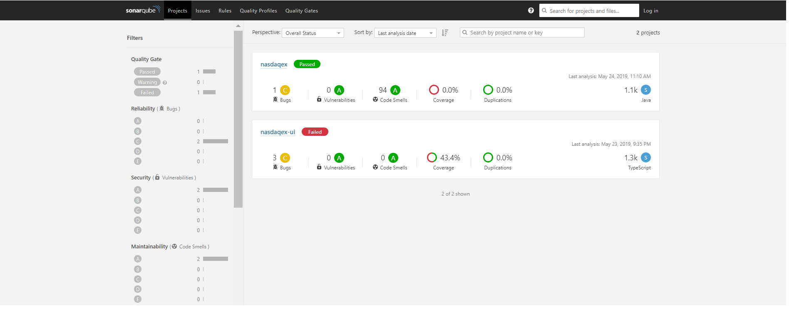
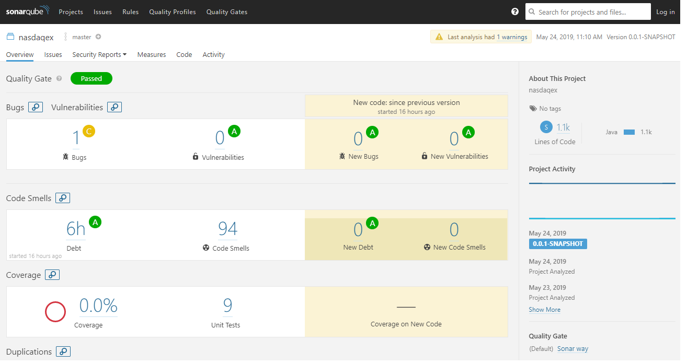
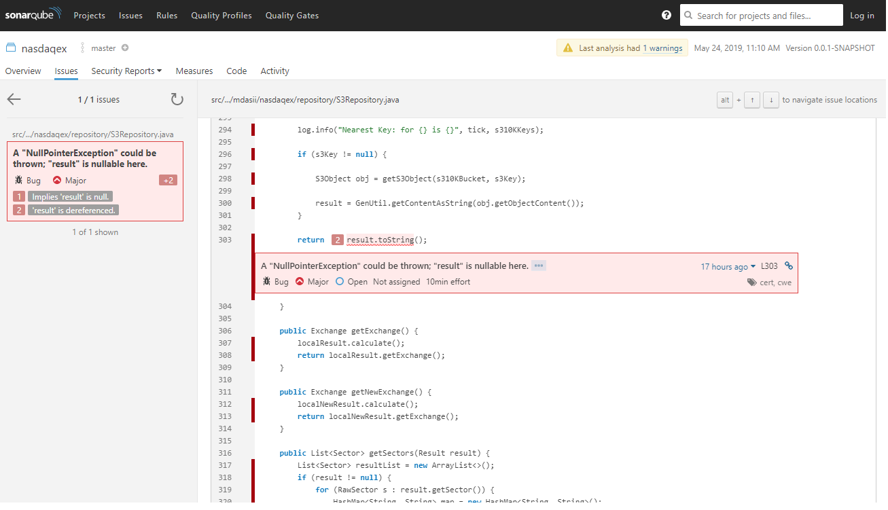
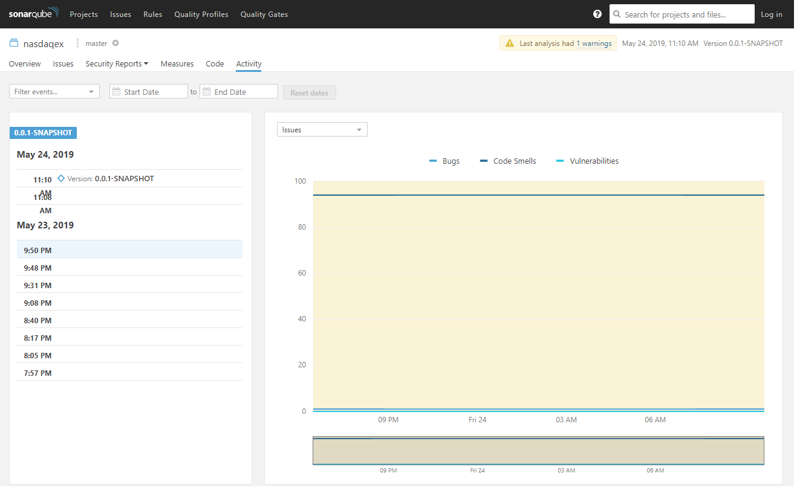

**MDAS Readme**
Using SonarQube source code analysis tool in a Jenkins pipeline, the scan identified bugs and vulnerabilities in the code. The pipeline downloaded code from a git repository and ran the scan. The tool provides drill-down capability to reach the actual code having the vulnerability or bug. While the tool provides several interfaces to analyze the issues, below provide a sample view of the scan result.  To view and drill-down to the details click [here](http://www.bing.com)

1. A summary report of the scan result showing that it Failed

2. The scan found 3 bugs and no security vulnerabilities

3. The bugs identified at the code location will be fixed and resolved in the next build. 

4. The graphical representation of the bugs in recent builds shows progress being made in resolving the issues. 
 
